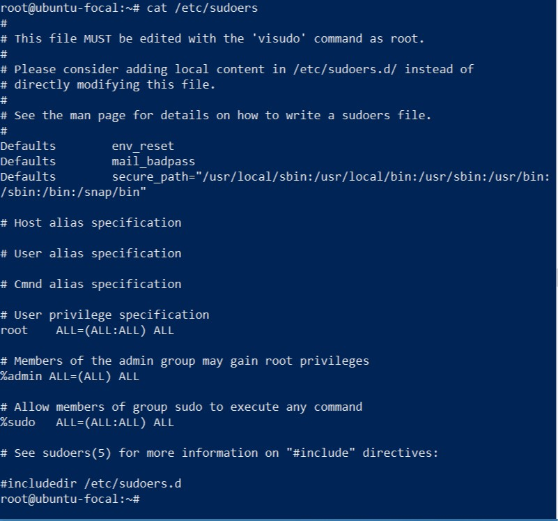

# Excercise 2
change to root user

CPU Info

System date

Display Calender

Available Free Memory

Display group

Display hostname

display login log

Display password

Display present envinronment directory

Display memory information

ps

remove file

display sudoers

display machine name

display vagrant ID

Display present working directory

